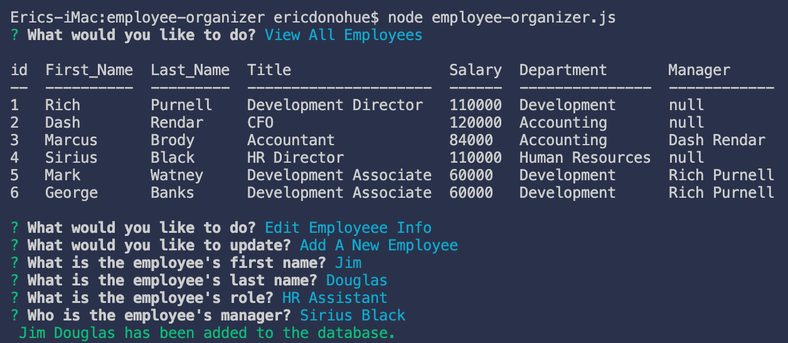
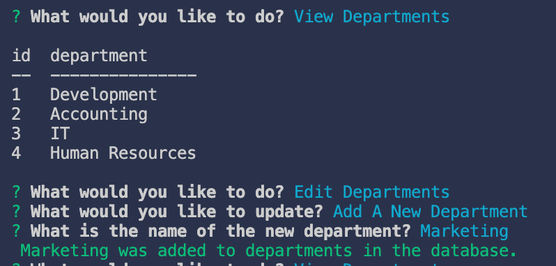

# MySQL: Employee Tracker

## Table of Contents

* [Description](#description)

* [Process](#process)

* [Installation](#installation)

* [Technology](#technology)

* [Dependencies](#dependencies)

* [Demo](#demo)

* [Screenshots](#screenshots)

* [Author](#author)

## Description

In this assignment, I was tasked with building a command-line app to view/organize an employee database using node, inquirer, and MySql.

## Process

My first step was to create my database schema and seed files in MySql.  My tables included department, role, and employee. 

Afterwards, I installed the required node packages and declared them in my JavaScript file.  I then created a connection to my database in MySql.

Next, I set up my tables using console.table.  Then, I worked on my prompt functionality utilizing inquirer.

Lastly, I used [Screencastify](https://www.screencastify.com/) to record a demonstration of myself illustrating how the app functions.

## Installation

Please first set-up database by opening and executing schema and seed sql files in db folder with MySqlWorkbench.  After database is ready to be queried, open 'employee-organizer.js' to make sure your connection port is correct on line 40 and to enter your MySql root password on line 42.

To install necessary dependencies, run the following command:

```
npm install
```

The application can be initialized by entering the command:

```
node employee-organizer.js
```

## Technology

* JavaScript

* Node.js

* MySql

## Dependencies

* [MySql](https://www.npmjs.com/package/mysql)

* [InquirerJs](https://www.npmjs.com/package/inquirer/v/0.2.3)

* [console.table](https://www.npmjs.com/package/console.table)

## Demo
### Video Demonstration Link
[Click here](https://drive.google.com/file/d/1dfRsXYtHTc_r4Pfcd1ZtbcDdIgc0mjkr/view?usp=sharing)
(After clicking link, please view in full-screen.)

## Screenshots

* **Terminal - Adding Employee**


* **Terminal - Adding Role**


* **Terminal - Adding Department**


## Author

* **Eric Donohue**

### Other Projects

Please visit [edonohue8](https://github.com/edonohue8/) to see more of my projects.
