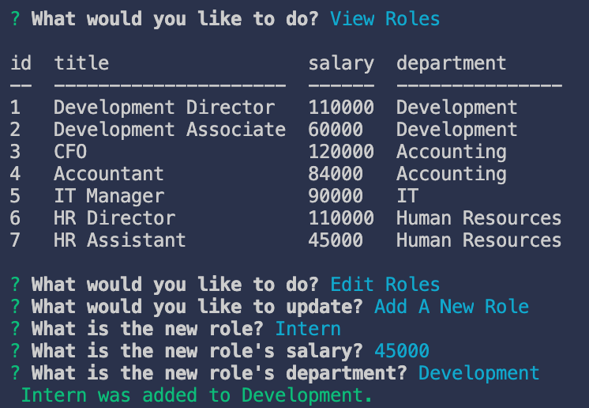

# MySQL: Employee Tracker

The application can be initialized by entering the command:

```
node employee-organizer.js
```

## Table of Contents

* [Installation](#installation)

* [Screenshots](#screenshots)

* [Author](#author)

## Installation

To install necessary dependencies, run the following command:

```
npm install
```

## Screenshots

* **Terminal - Adding Employee**


* **Terminal - Adding Role**


* **Terminal - Adding Department**


## Author

* **Eric Donohue**

### Other Projects

Please visit [edonohue8](https://github.com/edonohue8/) to see more of my projects.
